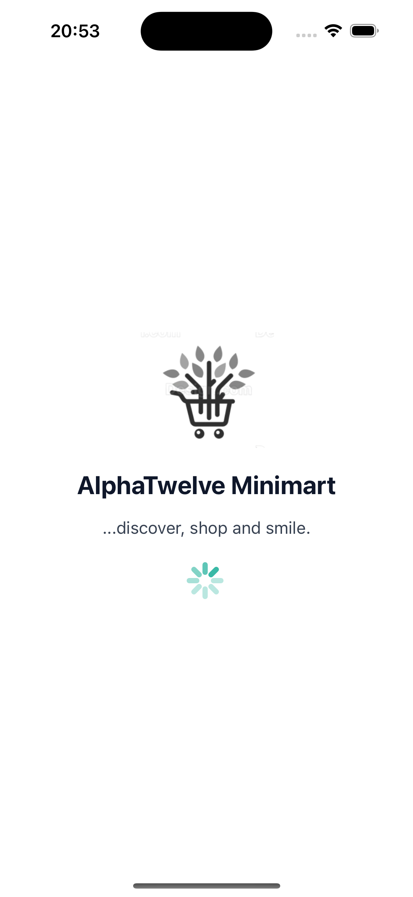
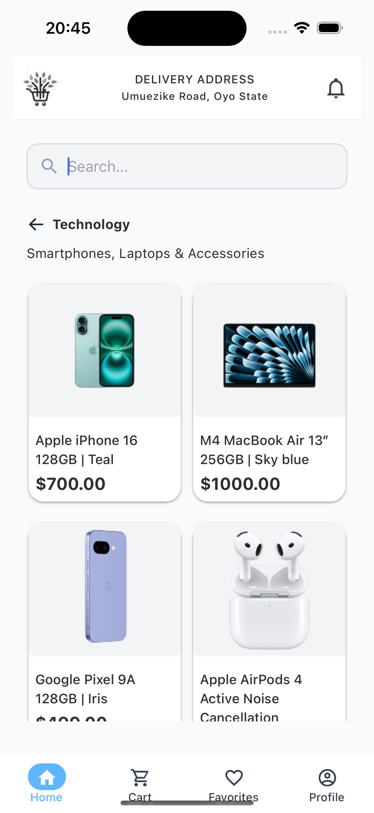
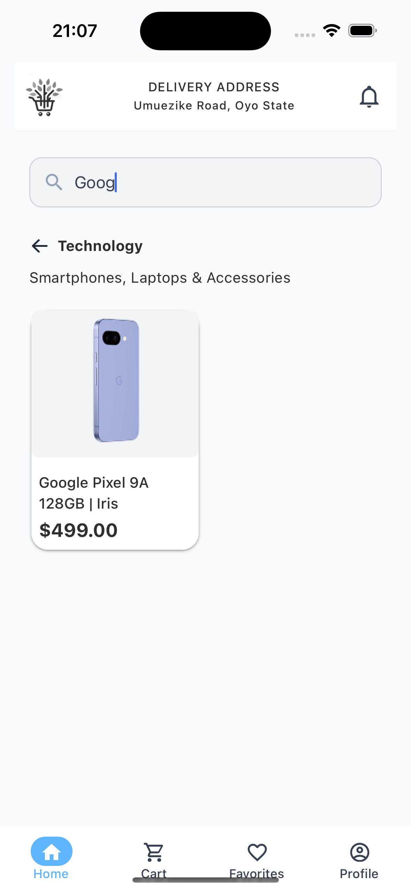
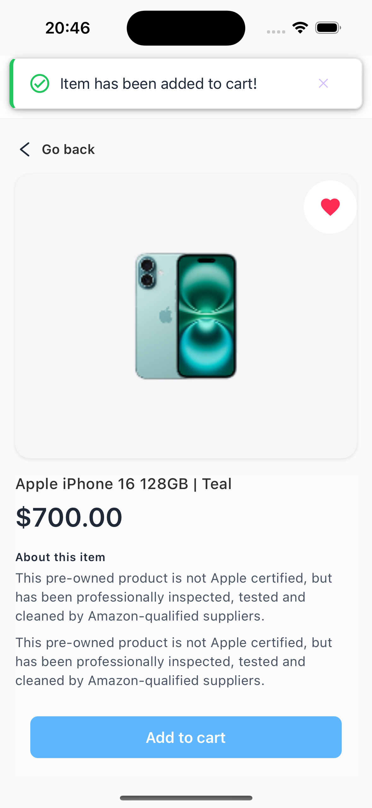
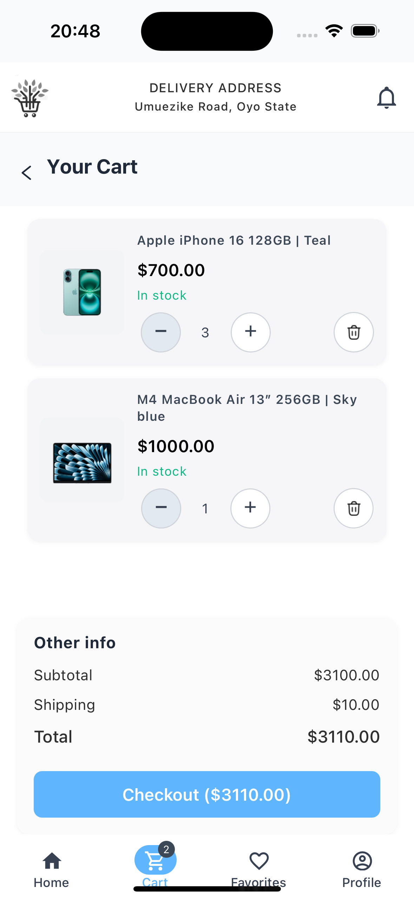

## AlphaTwelve Minimart
A modern, sleek, and responsive cross-platform shopping app built with React Native Expo.
### 📌 Project Overview
 > AlphaTwelve Minimart is a feature-rich eCommerce preview application designed to provide users with an intuitive shopping experience. Developed using React Native and Expo, this app demonstrates key functionalities such as product browsing, search, favorites, cart management, and splash screen animations—complete with super sleek and polished UI/UX.
###  Features
##### Splash Screen Animation
- Custom animated splash with logo, brand name, and slogan
- Displays for a total of 5 seconds before navigating to Home
##### Home / Product Listing
- Fully responsive two-column grid of products
- Product cards show image, name, and price
- Real-time search bar with debounce to filter product list
##### Product Details
- Detailed view showing larger image, name, description, and price
- “Add to Cart” button with haptic feedback and snack bar notifications
##### Favorites
- Add/remove items to Favorites via heart icon
- Favorites screen displaying saved items in a responsive grid
##### Global State Management
- Context API for Cart, Favorites, Products, and Alerts
- Custom hooks (useCart, useFavorites, useProducts, etc.)
##### Navigation
- Implemented a dynamic bottom tab navigation with Expo router
- Expo Router’s file-based routing with tab navigation (Home, Favorites, Cart, Profile)
- Stack navigation for nested screens (e.g., Product Details)
##### UI/Styling
- Tailwind CSS via NativeWind for styling consistency
- React Native Paper components for typography, cards, buttons, and snack bars
- Pixel-perfect adherence to Figma design
##### Splash & Icon Configuration
- Minimal native splash (splash-blank.png) configured in app.json
- Custom animated React Native splash (logo fade, brand name, slogan)
- App icon generated from a 1024×1024 PNG and referenced in app.json

###️ Tech Stack
- Frontend Framework: React Native with Expo (For cross-platform apps)
- Global State Management: React context API
- Routing: Expo Router
- React native paper for super sleek UI/UX
### Installation
#### Prerequisites
Ensure you have the following installed:
- Node.js (>= 18.x)
- npm or yarn

#### 1. Clone Repository
```sh
git clone https://github.com/your-username/alphatwelve-minimart.git
cd alphatwelve-minimart
```
### 2. Install Dependencies
```sh
npm install  # or yarn install
```
#### 3. Run the Expo development server
```
expo start
```
### 4. Open in Expo Go
- Scan the QR code with your physical device (Expo Go app).
- Or press i to open in iOS Simulator / a for Android emulator.
### 5. (Optional) Create a Custom Dev Client
```
eas build --profile development --platform ios
# then install the generated .app on simulator/device
# This lets you see the real native splash & icon instead of Expo Go’s.
```
<h3>Example Screenshots</h3>











#### Usage
1. On the home screen choose a product category and browse products, use the search bar, tap a product to view details.
2. Product Details: Read description, add item to cart. A snack bar confirms the action.
3. You will be navigated to the product details screen, make product your favorite by tapping the heart icon on product cards or add to the cart.
4. Cart: Adjust quantities, remove items, as you desire.
5. Proceed to checkout screen to make payment for your purchase.
6. AlphaTwelve Minimart says, “Thanks for your patronage!" 🥰

### 🔨 Building & Generating APK
After thorough testing in Expo Go or a custom dev client, you can produce a standalone APK for Android:
### 1. Configure credentials (only needed first time):
```
 eas credentials
```
### 2. Build the Android app
```
eas build --platform android
```
### 3. Download the generated APK or AAB
- The build dashboard will give you a public download link.
- You can install the APK on any Android device or emulator.
### 4. Test the stand-alone app
- Verify the native splash (blank white → custom animated splash → home)
- Check the app icon on your device home screen
⚠️ Note: The iOS build process requires a paid Apple developer account to distribute.

### 🚀 Deployment
```
npx expo start
# select the platform to run, android, ios or web
```
####  Contributing
- 1. Fork the repo
- 2. Create a feature branch (git checkout -b feature/...)
- 3. Commit your changes (git commit -m "...")
- 4. Push to your fork (git push origin feature/...)
- 5. Open a Pull Request
Please follow the established code style, include tests if applicable, and provide clear commit messages.
### License
This project is licensed under the MIT License. Feel free to use, modify, and distribute it.

### Developer
- ##### 👨‍💻 Built and Developed with ❤️ by *Chiedozie Ezidiegwu* [LinkedIn](https://www.linkedin.com/in/chiedozie-ezidiegwu-9859a5167/)
- ##### courtesy of AlphaTwelve Team.
##### *Thanks for reading and happy coding.🎉*